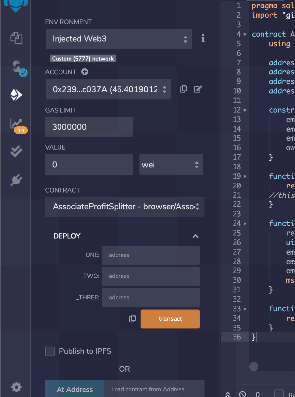

# Profit Splitter Smart Contracts (3-templates)

## Associate Profit Splitter 

* [`AssociateProfitSplitter.sol`](templates/AssociateProfitSplitter.sol)

This contract template is made to accept Ether as a deposit and then distribute it equally among three employees and if there is a remainder it would be kicked back to the owner(deployer) of the contract. Also the owner of the contract is the only one able to deposit Ether into the contract!

Balances before transactions(Image)

 

Creating Transaction Demo(Gif)

 

Balances after transactions(Image)

 

 

## Tiered Profit Splitter 

* [`TieredProfitSplitter.sol`](templates/TieredProfitSplitter.sol)

This contract template is made to accept Ether as a deposit and then distribute it to employees at different positions.  For example, CEO vs CTO and so on, based on percentages and if there is a remainder it would be kicked back to employee with the lowest pay. Also the owner of the contract is the only one able to deposit Ether into the contract!

Balances before transactions(Image)

 

Creating Transaction Demo(Gif)

 

Balances after transactions(Image)

 

 

## Deferred Equity Plan 

* [`DeferredEquityPlan.sol`](templates/DeferredEquityPlan.sol)

This smart contract template manages and distributes a 1000 shares of a company to an employee equally over 4 years, similar to traditional company stock plans.  There is no need for Ether deposits into the contract. Rather all this contract does is to enforce the vetting periods automatically.  The contract stores amounts that represent the total amount of shares(1000) that are meant to incentivize employees to stay with the company. It stores amounts that represent unvested shares and enforces their distribution only if enough time has passed. After all the shares have vested then the contract deactivates.

Demo(Gif)

 
This Demo uses a fastforward function that simulates time being fastforwarded into the future in order to show how the contract behaves through the vesting periods and how it handles the timelock functionality.

